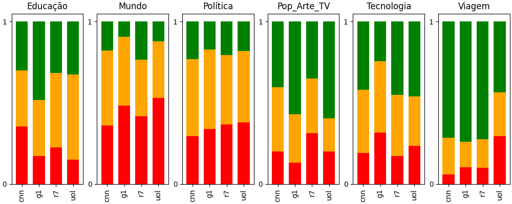

# Análise de Sentimento de Notícias

Em uma linguagem de processamento natural conhecida como [BERT](https://blog.research.google/2018/11/open-sourcing-bert-state-of-art-pre.html), é possível prever sentimentos de frases. E nesta configuração temos três características com uma predominante: POSITIVO, REGULAR ou NEGATIVO. Sendo possível coletá-las dentro de um intervalo entre 0 e 1, segue exemplo abaixo: 

Foi desenvolvido então uma coleta de dados do dia corrente, conhecida como raspagem ou <i>scraping</i> de quatro portais de notícias: CNN, G1, R7 e UOL. Com seus respectivos editoriais semelhantes de: Educação, Mundo, Política, Pop Arte e TV, Tecnologia e Viagem. Sendo gerado uma fonte de dados tipo [csv](noticias_2023-10-19_14_01_34.csv). Através desta fonte foi gerado um gráfico de barras empilhadas com as respectivas médias:

Nota-se os seguintes apontamentos sobre os editoriais:
<ol>
  <li>"Educação" tem notícias mais positivas no portal G1;</li>
  <li>"Mundo" e "Política" têm uma média regular/negativa e uma tendência para o negativo;</li>
  <li>"Pop_Arte_TV" e "Viagem" têm uma tendência para o positivo;</li>
  <li>O portal G1 em "Tecnologia" tem uma tendência para o regular/negativo, diferente de outros portais. Já em "Educação" acontece o contrário;</li>
</ol>

